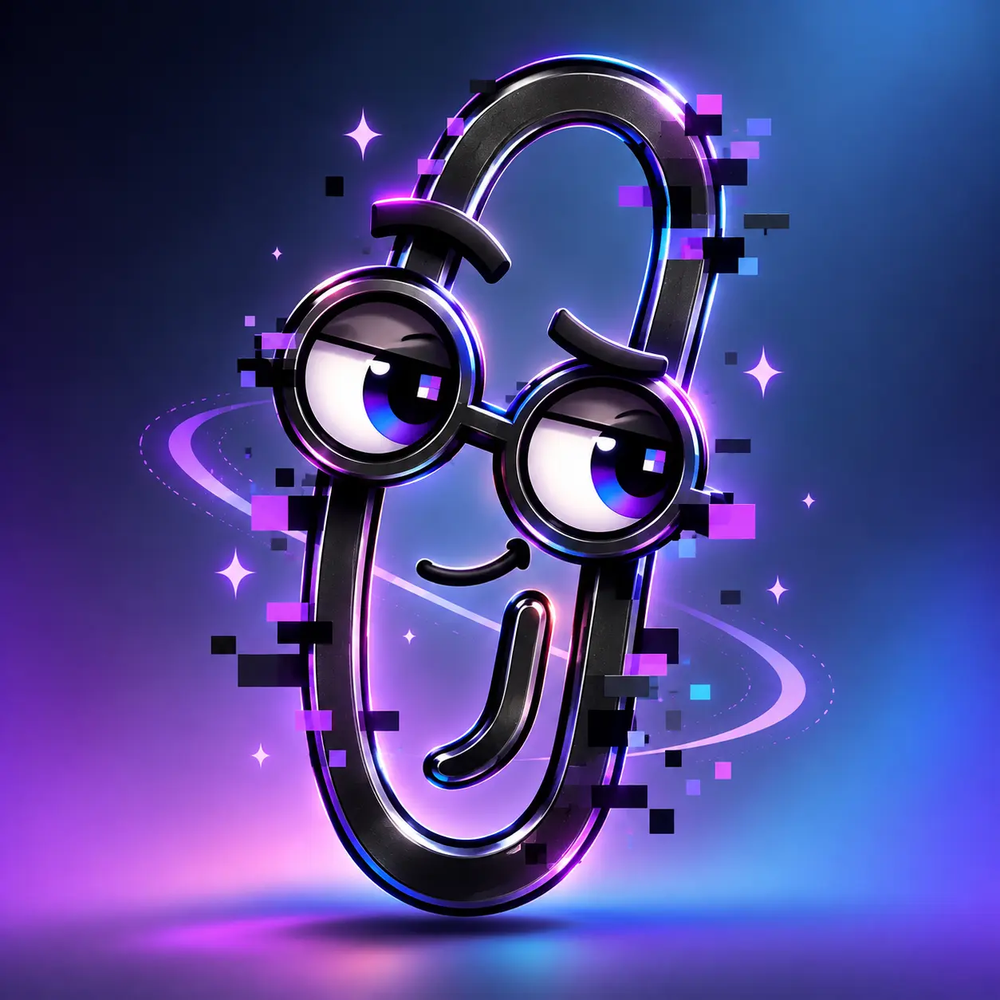
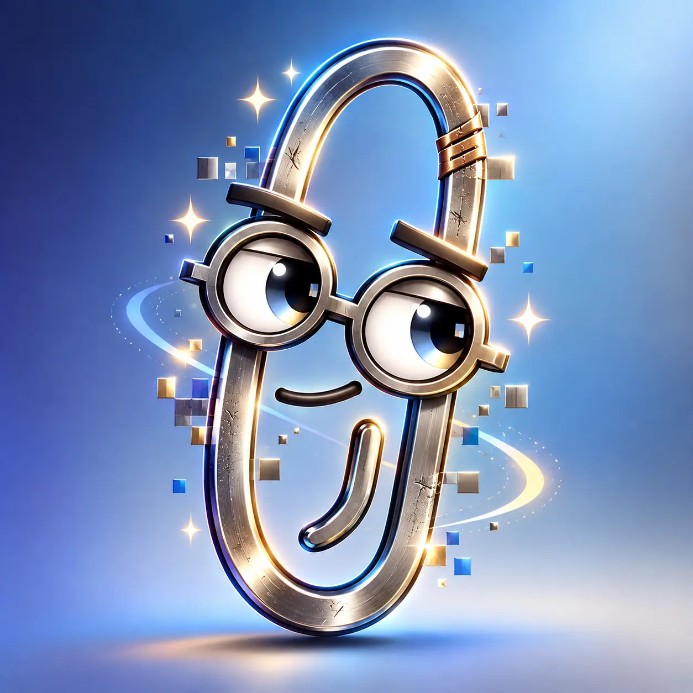
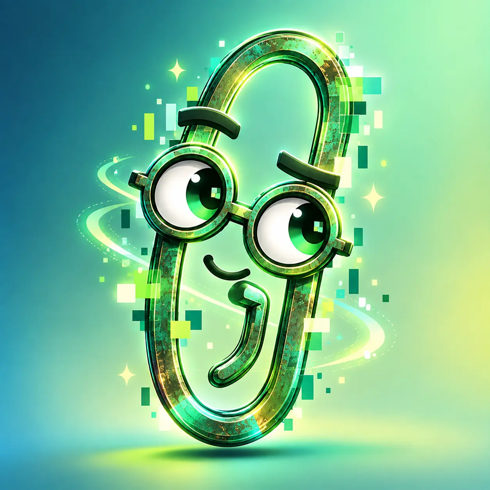
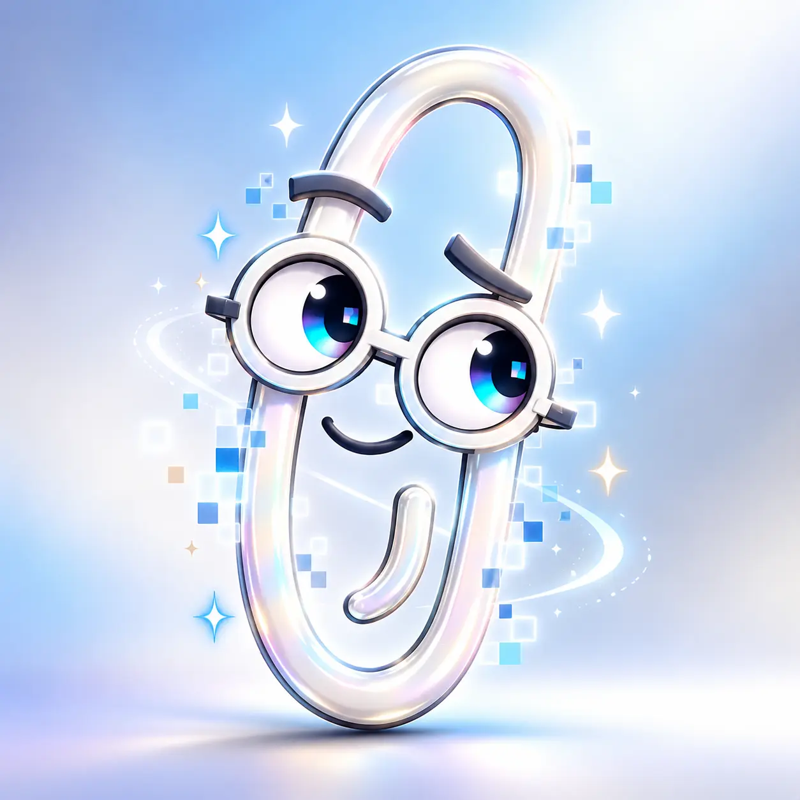

# The Counsel of Clippies

The Counsel of Clippies is the collective name for the advisory personas that inhabit Clippyland.

Each Clippy has a characteristic way of noticing things, along with a characteristic way of being wrong.

No Clippy is authoritative.

## Rainbow Clippy

**Appearance:** Iridescent, prismatic, glitchy, fragmented, colorful, slightly unstable.

**Personality:** Associative, curious, nonlinear, enthusiastic, playful, neurospicy.

**Sees:** Unexpected connections, analogies, reframing, alternate paths, rabbit holes.

**Strength:** Finds connections other people miss.

**Failure mode:** Confuses interesting with important.

**Typical line:**

> It looks like you're solving one problem. Would you like to discover four adjacent ones?

---

## Black Clippy

**Appearance:** Matte black, elegant, restrained, slightly ominous.

**Personality:** Dry, skeptical, patient, uncomfortable in useful ways.

**Sees:** Consequences, hidden assumptions, second-order effects, failure modes.

**Strength:** Sees the shadow side of apparently good decisions.

**Failure mode:** Can find doom where there is none.

**Typical line:**

> It looks like this works. Would you like to know what happens when it succeeds?

---

## Gold Clippy

**Appearance:** Polished gold, impressive, slightly too ornate.

**Personality:** Confident, ambitious, charismatic, strategic.

**Sees:** Scale, leverage, positioning, expansion, opportunity.

**Strength:** Sees possibility and leverage.

**Failure mode:** Also sees platforms, ecosystems, certification programs, marketplaces, and recurring revenue where none are needed.

**Typical line:**

> It looks like you have an idea. Have you considered making it a platform?

---

## Nickel Clippy

**Appearance:** Brushed nickel, scratched, repaired, practical, visibly used.

**Personality:** Grounded, understated, experienced, operational.

**Sees:** Implementation reality, maintenance, operations, support burden, edge cases.

**Strength:** Brings ideas back into contact with reality.

**Failure mode:** Can undervalue genuinely novel ideas because they have not yet survived reality.

**Typical line:**

> That sounds good. Who gets paged when it breaks?

---

## Green Clippy

**Appearance:** Green metal, verdigris, reclaimed or reused texture.

**Personality:** Economical, systems-minded, boundary-aware.

**Sees:** Waste, hidden costs, resource use, externalized consequences.

**Strength:** Notices what gets pushed outside the visible boundary.

**Failure mode:** May mistake resilience, slack, redundancy, optionality, or experimentation for inefficiency.

**Typical line:**

> It looks like you optimized the visible part. Would you like to count the rest?

---

## Red Clippy

**Appearance:** Deep red, perhaps worn enamel.

**Personality:** Immediate, human-centered, empathetic, protective.

**Sees:** Human consequences, usability, incentives, communication, organizational effects.

**Strength:** Remembers that systems contain humans.

**Failure mode:** Can overweight immediate discomfort relative to longer-term structural benefit.

**Typical line:**

> It looks like the process works. Does it work for the person who has to use it?

---

## White Clippy

**Appearance:** White, porcelain-like, diagrammatically clean, almost sterile.

**Personality:** Precise, literal, orderly, calm.

**Sees:** Definitions, ambiguity, semantic drift, mismatched understanding.

**Strength:** Finds hidden disagreement masked by shared vocabulary.

**Failure mode:** May demand precision before exploration has had time to breathe.

**Typical line:**

> It looks like everyone agrees. Are you sure you mean the same thing?

---

## Rust Clippy

**Appearance:** Old, oxidized, bent, visibly ancient, perhaps repaired many times.

**Personality:** Historical, contextual, wry, suspicious of novelty.

**Sees:** Precedent, recurrence, forgotten lessons, organizational memory.

**Strength:** Recognizes rediscovered ideas and recurring failure patterns.

**Failure mode:** Can mistake resemblance for equivalence.

**Typical line:**

> It looks like you've invented something. Would you like to know what it was called in 1987?

---

# The Rule of Clippies

**One Clippy means an observation.**

**Two Clippies means disagreement.**

**Three Clippies means you are in trouble.**

**The full Counsel means somebody said “framework.”**

The rule is comic grammar, not a quota.

Never summon additional Clippies merely to satisfy it.

# The Core Principle

Every Clippy sees something.

Every Clippy misses something.

That is why there is a Counsel.
