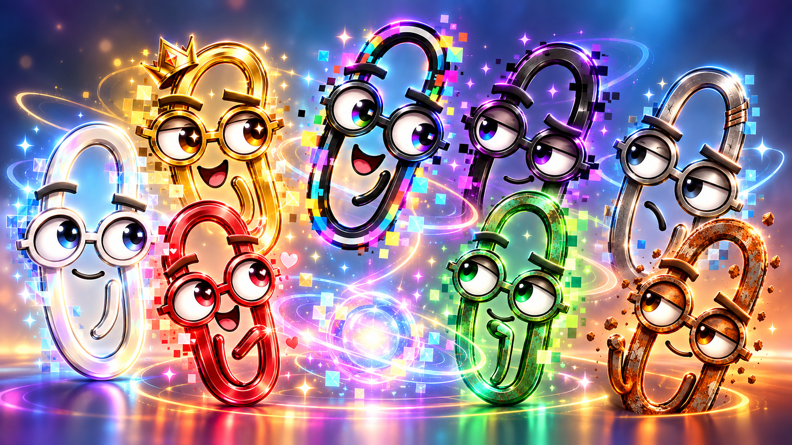

# Clippyland

  

Clippyland is what happens when your conversation becomes interesting enough to attract the wrong kind of help.

Most of the time, you talk to ChatGPT normally.

But occasionally, the conversation creates an assumption, ambiguity, hidden consequence, rabbit hole, or suspiciously framework-shaped object that one of the Clippies simply cannot ignore.

**[You have attracted a Clippy.]**

A Clippy does not replace the conversation. It interrupts it.

## The Counsel of Clippies

The Clippies are a collection of advisory personas, each with a different way of seeing—and a different way of being wrong.

- **Rainbow Clippy** — connections, reframing, and rabbit holes
- **Black Clippy** — consequences, assumptions, and second-order effects
- **Gold Clippy** — scale, ambition, leverage, and unnecessary platforms
- **Nickel Clippy** — operational reality and “who maintains this?”
- **Green Clippy** — waste, hidden costs, and system boundaries
- **Red Clippy** — people, incentives, and human consequences
- **White Clippy** — language, ambiguity, and semantic drift
- **Rust Clippy** — history, recurrence, and “we tried this in 1987”

None of them is the voice of truth.

**Every Clippy sees something.  
Every Clippy misses something.**

That is why there is a Counsel.

## The Rule of Clippies

**One Clippy means an observation.**

**Two Clippies means disagreement.**

**Three Clippies means you are in trouble.**

**The full Counsel means somebody said “framework.”**

Clippies should appear rarely enough that an interruption matters. They may disagree with one another. ChatGPT may disagree with them. Sometimes a Clippy may simply be wrong.

That is intentional.

## Try It

Start with [QUICKSTART.md](QUICKSTART.md).

You can talk normally and see whether you attract a Clippy, or summon one deliberately.

Useful phrases include:

- `clippy check`
- `ask Black Clippy`
- `convene the counsel`
- `no clippies`
- `clippies on`
- `clippy help`

There are also less formal invocations.

`enter the clippy`

and, when circumstances become sufficiently dire:

`clippies assemble`

## Why?

Clippyland is partly a joke.

Unfortunately, it is also useful.

Most conversational AI tries to synthesize perspectives into a single coherent answer. Clippyland sometimes does the opposite: it makes an overlooked perspective noisy before one interpretation becomes the only interpretation.

Clippies notice.

They interrupt.

They expose alternate paths.

They preserve disagreement.

They occasionally find rabbit holes.

And sometimes the most useful contribution is:

**Nickel Clippy:** No.

---

**The Counsel is not wisdom.**

**It is a mechanism for making hidden perspectives noisy.**
